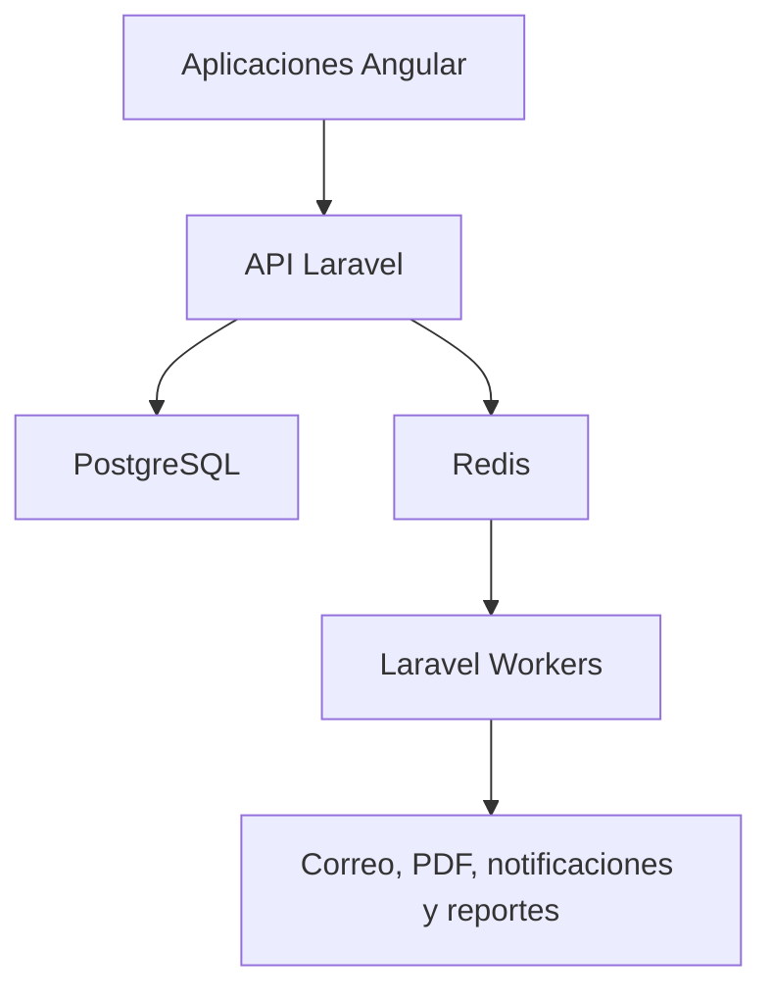

# MisVales Backend

Backend oficial del sistema **MisVales**, desarrollado con Laravel.

MisVales administra líneas de crédito asignadas a distribuidoras, generación y validación de vales, clientes finales, relaciones de pago, conciliaciones, categorías, puntos, autorizaciones, auditoría y procesos operativos por sucursal.

La especificación funcional oficial se encuentra en el repositorio `misvales-documentation`, dentro del archivo `MisValesInfo.md`. Ninguna regla de negocio debe implementarse por deducción ni modificarse sin una definición aprobada.

## Responsables

| Función | Integrantes |
|---|---|
| Backend | Daniel y Jorge |
| Líder y QA | Alberto |
| Infraestructura en DigitalOcean | Azael |

## Tecnologías

- Laravel.
- PostgreSQL.
- Redis.
- Laravel Sanctum.
- Laravel Queue y Laravel Workers.
- OpenAPI para el contrato de la API.
- PHPDoc para documentación dentro del código.

## Responsabilidades del repositorio

- Exponer la API utilizada por las tres aplicaciones Angular.
- Implementar las reglas de negocio confirmadas de MisVales.
- Administrar autenticación, sesiones, permisos por rol y alcance por sucursal.
- Gestionar distribuidoras, clientes finales, prevales y vales digitales.
- Calcular préstamos, relaciones, comisiones, recargos y puntos.
- Gestionar fechas de corte, referencias de pago y conciliaciones.
- Implementar transferencias, reasignaciones y cambios de sucursal autorizados.
- Registrar auditoría, cambios de estado, autorizaciones y eventos relevantes.
- Ejecutar trabajos en segundo plano mediante Redis Queue y Laravel Workers.

## Arquitectura general



Los Workers ejecutan código de este mismo repositorio. Redis y los Workers no son aplicaciones ni repositorios independientes.

## Autenticación y sesiones

La autenticación definida para MisVales utiliza tokens opacos vinculados a sesiones persistidas:

- Access token opaco de corta duración, almacenado solamente mediante hash.
- Refresh token opaco con rotación, familia y expiración absoluta, entregado exclusivamente en cookie segura `HttpOnly`.
- PostgreSQL como fuente de verdad para cuentas, sesiones y tokens.
- Redis para desafíos, bloqueos, límites y revocación inmediata distribuida.
- Protección CSRF para las operaciones que dependan de cookie.
- Sin JWT ni tokens persistidos en `localStorage` o `sessionStorage`.

La autorización siempre debe verificarse en el backend. Las validaciones del frontend no sustituyen las Policies, middleware ni controles por rol y sucursal.

## Redis y procesos en segundo plano

Redis se utilizará para:

- Colas.
- Sesiones.
- Rate limiting y sus contadores.
- Tokens temporales de autorización.
- Coordinación de procesos en segundo plano.

Flujo de trabajos asíncronos:

```text
Laravel -> Redis Queue -> Laravel Worker -> Correo / PDF / notificación / reporte
```

## Base de datos

PostgreSQL es la base de datos principal. El esquema debe administrarse mediante migraciones versionadas dentro de este repositorio.

Reglas obligatorias:

- Utilizar transacciones en operaciones financieras.
- Evitar operaciones duplicadas.
- No eliminar registros financieros históricos.
- No modificar relaciones cerradas sin un proceso autorizado.
- Validar CURP, folios, referencias y números de transacción.
- No hardcodear fechas, porcentajes, puntos, categorías, recargos ni valores de cálculo.
- Aplicar cambios de configuración solamente a operaciones futuras sin alterar el historial.

## Auditoría

La auditoría debe conservar, cuando corresponda:

- Información original y modificada.
- Usuario solicitante, autorizador y ejecutor.
- Fecha, hora, sucursal, sesión o dispositivo.
- Motivo de la modificación.
- Tokens utilizados.
- Conciliaciones manuales.
- Transferencias y reasignaciones.
- Incrementos de línea.
- Cambios de categoría, sucursal o estado.
- Canjes de puntos, alertas de riesgo y decisiones de morosidad.

Los tokens de autorización son de un solo uso, tienen una vigencia exacta de cinco minutos y deben quedar vinculados al usuario, operación, sucursal y registro autorizado.

## Ambientes

El backend se manejará en tres ambientes separados:

- Desarrollo.
- QA.
- Producción.

Azael administra la infraestructura y los despliegues directamente en DigitalOcean Droplets. La infraestructura no forma parte de este repositorio.

## Configuración local

Requisitos:

- PHP 8.4.1 o posterior; el objetivo de producción es PHP 8.5.
- Composer.
- PostgreSQL.
- Redis.

Después de clonar el repositorio:

```bash
composer install
cp .env.example .env
php artisan key:generate
php artisan migrate
php artisan serve
```

Comandos de calidad:

```bash
composer lint
composer analyse
composer test
composer check
```

Para procesar las colas durante el desarrollo:

```bash
php artisan queue:work redis
```

Los valores reales de conexión, credenciales, claves y secretos nunca deben incluirse en Git.

## Pruebas

Las pruebas unitarias y de integración del backend deben mantenerse dentro de este repositorio.

```bash
php artisan test
```

No se debe afirmar que una funcionalidad está terminada únicamente porque compila. Debe cumplir los requisitos aprobados y pasar la revisión de QA.

## Documentación de la API

El contrato OpenAPI oficial se conserva en `misvales-documentation`. Todo cambio que modifique endpoints, solicitudes, respuestas o errores debe actualizar también el contrato correspondiente.

El código público, clases, servicios y métodos que lo requieran deben documentarse mediante PHPDoc.

## Flujo Git

Ramas autorizadas:

- `main`: código estable de producción.
- `develop`: integración del trabajo aprobado.
- `feature/*`: nuevas funcionalidades.
- `bugfix/*`: correcciones normales.
- `release/*`: preparación de versiones.
- `hotfix/*`: correcciones urgentes de producción.

Reglas obligatorias:

1. Toda tarea debe tener una rama propia.
2. No se permite trabajar directamente en `main` o `develop`.
3. Todo cambio debe ingresar mediante Pull Request.
4. El autor no puede aprobar ni fusionar su propio Pull Request.
5. Los nuevos commits invalidan las aprobaciones anteriores.
6. Todas las conversaciones deben resolverse antes del merge.
7. Solo Alberto, un QA autorizado o el responsable de versión puede realizar el merge.
8. No se permite push directo ni force push sobre ramas protegidas.

## Seguridad

- Aplicar mínimo privilegio.
- Restringir cada operación por rol y sucursal.
- Cifrar las comunicaciones.
- Proteger contraseñas mediante algoritmos de hash seguros.
- No registrar contraseñas, cookies, tokens ni datos personales sensibles en logs.
- Validar archivos de conciliación antes de procesarlos.
- Registrar errores y permitir reintentos controlados.
- Mantener trazabilidad de las operaciones críticas.

## Versionado

El proyecto utiliza versionado semántico:

```text
vMAJOR.MINOR.PATCH
```

- `MAJOR`: cambios incompatibles.
- `MINOR`: funcionalidades compatibles.
- `PATCH`: correcciones compatibles y ajustes menores.
