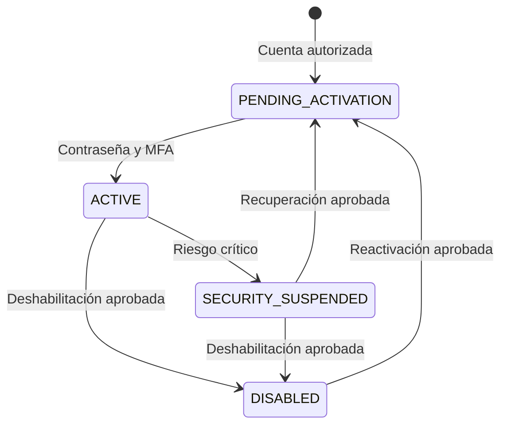
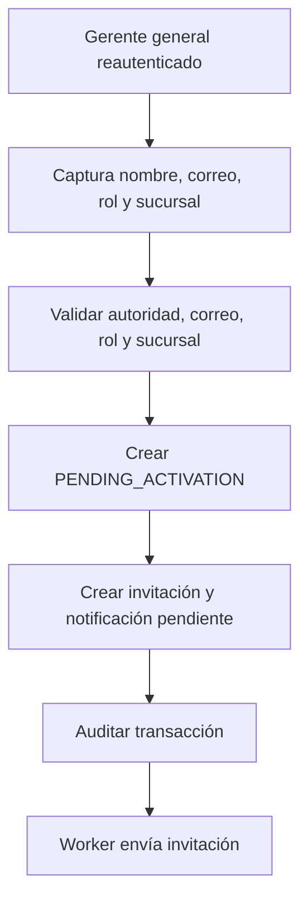
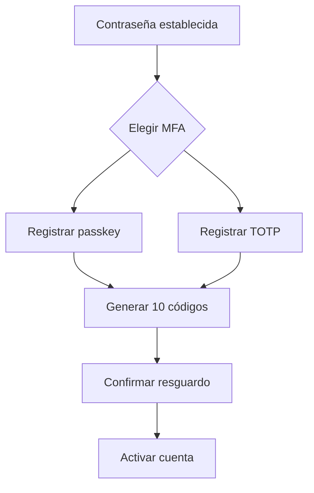
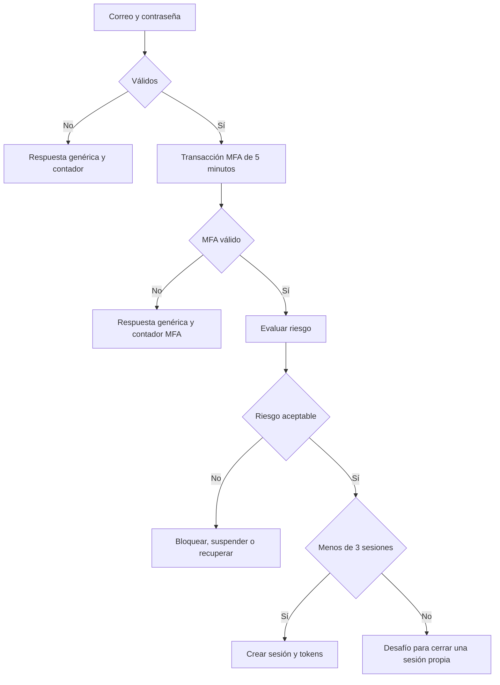
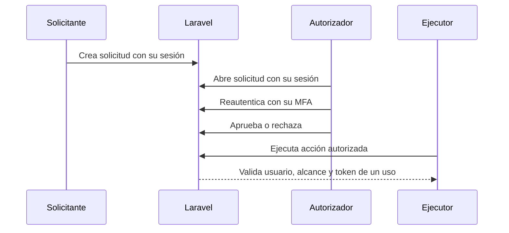

# MisVales-M01-Acceso-Backend

# MisVales — M01 Acceso — Desarrollo backend

## Entorno de desarrollo

- El repositorio:  https://github.com/trejosau/docker ya incluye lo necesario para levantar PostgreSQL, Redis y los demás servicios externos del entorno de desarrollo.

## Reglas obligatorias para todo el backend

1. El correo electrónico es el único identificador de inicio de sesión.
2. Cada cuenta tiene exactamente un rol y ese rol es inmutable.
3. No existe endpoint, comando ni proceso para cambiar una cuenta de rol.
4. Una persona que ocupa una responsabilidad diferente recibe una cuenta nueva mediante el flujo autorizado; la cuenta anterior se deshabilita y conserva su historial.
5. El cliente final nunca tiene cuenta ni puede autenticarse.
6. Los siete perfiles con acceso son `GENERAL_MANAGER`, `SUCURSAL_MANAGER`, `COORDINATOR`, `VERIFIER`, `ADMINISTRATOR`, `DISTRIBUTOR` y `CASHIER`.
7. Todos los perfiles utilizan contraseña y MFA obligatorio.
8. Passkey/WebAuthn es el método recomendado; TOTP es la alternativa. Los códigos de recuperación solo permiten recuperar el acceso.
9. El backend es la autoridad para identidad, sesión, permisos, sucursal, jerarquía, asignaciones, separación de funciones y estado del proceso.
10. Ocultar una ruta o botón en Angular nunca autoriza una operación.
11. Las cuentas, sesiones históricas, eventos de seguridad y auditorías no se eliminan físicamente.
12. Ningún correo contiene contraseñas, códigos MFA, códigos de recuperación o tokens completos.
13. Ningún secreto se escribe en logs, auditoría, excepciones, trazas o eventos.
14. PostgreSQL principal es la fuente de verdad para cuentas, sesiones, tokens y auditoría.
15. Redis centraliza bloqueos, desafíos, límites de solicitudes, caché breve y revocación inmediata para que todos los procesos apliquen las mismas reglas.
16. Si Redis no está disponible, login, renovación, reautenticación y acciones críticas fallan cerrado.
17. Ninguna función puede depender de que todas las solicitudes de una sesión lleguen al mismo servidor.
18. La fecha se conserva en UTC y se presenta con `America/Monterrey`.
19. Todo cambio de estado se ejecuta en transacción y evita crear resultados duplicados cuando una solicitud se repite.
20. Los controladores son delgados; las reglas viven en casos de uso, servicios de dominio, policies y middleware.

## Estructura de código

```
app/
├── Modules/
│   └── Access/
│       ├── Application/
│       │   ├── Accounts/
│       │   ├── Authentication/
│       │   ├── Authorization/
│       │   ├── MFA/
│       │   ├── Sessions/
│       │   └── Security/
│       ├── Domain/
│       │   ├── Accounts/
│       │   ├── Authentication/
│       │   ├── Authorization/
│       │   ├── MFA/
│       │   ├── Sessions/
│       │   └── Security/
│       ├── Infrastructure/
│       │   ├── Persistence/
│       │   ├── Redis/
│       │   ├── WebAuthn/
│       │   ├── Notifications/
│       │   └── Audit/
│       └── Presentation/
│           └── Http/
├── Http/
│   └── Middleware/
└── Providers/
```

Reglas de estructura:

- `FormRequest` valida forma, tipos y campos requeridos; el dominio valida reglas y autoridad.
- Cada escritura relevante usa un caso de uso transaccional.
- Las notificaciones y eventos por enviar se guardan en `outbox_events` dentro de la misma transacción. El worker los procesa únicamente después de confirmar el cambio principal.
- Todas las vigencias y vencimientos se calculan en el servidor y deben poder simularse en pruebas automatizadas.
- Cada caso de uso recibe los datos del usuario autenticado, su rol, sucursal, permisos y alcance necesarios para validar la operación.
- Los tokens y códigos se generan con funciones seguras del framework o con una biblioteca mantenida. No crear algoritmos propios.
- Los códigos estables de rol y permiso se utilizan en lógica; nunca los nombres visibles.
- El OpenAPI de `/api/v1` se actualiza junto con cada endpoint.

## Buenas prácticas y documentación del código

- Usar las convenciones configuradas en el repositorio y mantener compatibilidad con Laravel 13 y PHP 8.5.
- Escribir clases pequeñas y enfocadas. Los controladores reciben la petición, llaman al caso de uso y devuelven la respuesta; no contienen reglas de negocio.
- Usar tipos explícitos en propiedades, parámetros y retornos. Evitar `mixed` y arreglos sin estructura cuando pueda utilizarse un DTO, enum u objeto de valor.
- Usar enums para estados, roles, tipos de factor y códigos cerrados. No comparar textos visibles ni números mágicos.
- Validar entrada con `FormRequest`; validar permisos, sucursal, jerarquía, asignaciones y estados dentro del caso de uso y sus policies.
- Proteger asignación masiva en modelos. Nunca aceptar desde el cliente rol, sucursal, usuario autorizador o estado final sin volver a calcularlos en backend.
- Ejecutar en transacción la creación o cambio de cuenta, contraseña, MFA, sesión, autorización, auditoría y evento pendiente que deban quedar unidos.
- Prevenir duplicados cuando una solicitud pueda repetirse por doble clic, reintento de red, worker o evento duplicado.
- No capturar excepciones para ignorarlas. Convertir errores esperados al código de API correspondiente y dejar los inesperados al manejador central, sin exponer datos sensibles.
- No dejar código comentado, `dd()`, `dump()`, `var_dump()`, logs temporales ni `TODO` sin una tarea asociada.
- Ejecutar el formateador, análisis estático y pruebas configurados en el repositorio antes de integrar cada submódulo.

### PHPDoc obligatorio

- Documentar con PHPDoc cada caso de uso, servicio de seguridad, policy, middleware, evento, listener, job y DTO público de M01.
- El bloque de clase explica en una frase qué regla o flujo implementa.
- En métodos públicos, documentar parámetros, resultado y excepciones de negocio cuando los tipos de PHP no sean suficientes.
- Usar `@throws` para las excepciones que el método puede producir y que el llamador debe manejar.
- Especificar tipos de colecciones, arreglos estructurados y genéricos con anotaciones compatibles con el analizador estático configurado.
- Explicar el motivo de una validación de seguridad o negocio cuando no sea evidente. No escribir comentarios que solo repitan el código.
- Mantener PHPDoc actualizado al modificar una firma o regla. Un bloque desactualizado se considera un defecto.

Ejemplo de nivel esperado:

```php
/**
 * Deshabilita una cuenta autorizada y revoca inmediatamente todas sus sesiones.
 *
 *@throwsAccessDeniedException Si el usuario no tiene alcance sobre la cuenta.
 *@throwsAccountStateException Si la cuenta no puede pasar a deshabilitada.
 */
public function execute(DisableAccountData $data): void
{
    // La implementación valida autoridad, cambia el estado, revoca sesiones
    // y registra auditoría dentro de una sola transacción.
}
```

---

## B01 — Fundamento organizacional y permisos mínimos

En este bloque vamos a construir la base que utilizará todo M01 para saber quién es el usuario, qué rol tiene, a qué sucursal pertenece y qué permisos puede ejercer. Aquí todavía no se desarrollará la administración completa de sucursales, jerarquías y asignaciones; únicamente se dejarán el modelo mínimo, los catálogos, las relaciones y los contratos que M02 podrá completar posteriormente.

Al terminar, cada cuenta deberá tener un solo rol permanente, los perfiles con alcance de sucursal deberán estar vinculados a una sucursal activa y el backend contará con códigos de permisos estables para autorizar las operaciones de acceso.

### Qué debe desarrollar el equipo en este bloque

- Modelo mínimo de sucursal con identificador, nombre y estado.
- Sucursal matriz para el primer gerente general y datos de prueba.
- Catálogo sembrado de los siete roles.
- Catálogo de permisos propios de M01.
- Relación única `users.role_id`.
- Relación `users.branch_id` para cuentas con alcance de sucursal.
- Interfaces `EffectiveContextProvider` y `AssignmentStatusProvider`.
- Evento de invalidación cuando cambie permiso, sucursal, jerarquía o asignación.
- Factories para los siete perfiles.

### Permisos mínimos que deben quedar disponibles

| Código | Autoridad |
| --- | --- |
| `auth.context.read` | Consultar el contexto propio |
| `auth.sessions.read_own` | Consultar sesiones propias |
| `auth.sessions.revoke_own` | Revocar sesiones propias |
| `auth.password.change_own` | Cambiar contraseña propia |
| `auth.mfa.manage_own` | Administrar MFA propio |
| `accounts.global.create` | Crear cuentas internas permitidas |
| `accounts.branch.request` | Solicitar cuentas operativas de la sucursal propia |
| `accounts.global.approve` | Aprobar o rechazar solicitudes de cuentas |
| `accounts.global.disable` | Deshabilitar o reactivar cualquier cuenta |
| `accounts.branch.disable_request` | Solicitar deshabilitación o reactivación en la sucursal propia |
| `security.alerts.global.read` | Consultar alertas globales |
| `security.alerts.branch.read` | Consultar alertas de la sucursal propia |
| `security.audit.global.read` | Consulta global de seguridad en solo lectura |

### Reglas que debe cumplir la implementación

- `GENERAL_MANAGER` y `ADMINISTRATOR` tienen alcance global.
- `BRANCH_MANAGER`, `COORDINATOR`, `VERIFIER`, `CASHIER` y `DISTRIBUTOR` requieren una sucursal activa.
- El administrador es global y de solo lectura; no puede crear, aprobar, deshabilitar, reactivar ni recuperar cuentas.
- Una distribuidora conserva su rol y cuenta aunque entre en morosidad; la morosidad restringe funciones de negocio, no deshabilita el acceso permitido de consulta, pago y aclaración.
- M01 solo define el contrato mínimo. M02 administrará sucursales, permisos, jerarquías y asignaciones.

### Pruebas que debe implementar el equipo

- Los siete roles se siembran una sola vez aunque el seeder se ejecute dos veces.
- No se puede asignar más de un rol a una cuenta.
- Un rol de sucursal sin `branch_id` es rechazado.
- Un rol global con una sucursal operativa incompatible es rechazado.
- El administrador no recibe permisos de escritura.
- Las factories producen un contexto válido para cada perfil.

### Criterios para considerar terminado el bloque

- Migraciones, constraints, seeders y factories pasan en PostgreSQL.
- M02 puede implementar `EffectiveContextProvider` y `AssignmentStatusProvider` sin depender de clases internas de autenticación.
- Los códigos de rol y permiso están congelados en OpenAPI y pruebas.

---

## B02 — Persistencia de cuentas, sesiones y seguridad

En este bloque vamos a crear la estructura de PostgreSQL que conservará las cuentas, roles, permisos, solicitudes, invitaciones, contraseñas anteriores, factores MFA, sesiones, tokens, intentos de acceso, autorizaciones temporales, eventos de seguridad y eventos pendientes de envío.

El objetivo es que la base de datos haga cumplir las restricciones importantes y que ningún dato histórico o sensible dependa únicamente de validaciones del controlador. Los tokens y códigos se almacenarán solamente mediante hash cuando corresponda; las cuentas y los registros históricos no se eliminarán físicamente.

### Tablas que debe crear el equipo

| Tabla | Datos mínimos | Restricciones principales |
| --- | --- | --- |
| `users` | correo normalizado, nombre, hash de contraseña, rol, sucursal, estado, versión de contexto y fechas de seguridad | correo único global; rol obligatorio e inmutable; sin borrado físico |
| `roles` | código, nombre, estado | código único |
| `permissions` | código, nombre, estado | código único |
| `role_permissions` | rol y permiso | par único |
| `account_requests` | tipo, objetivo, rol, sucursal, solicitante, motivo, estado, decisión y clave contra duplicados | una decisión final; autoridad validada |
| `account_invitations` | cuenta, propósito, hash, emisión, vencimiento, uso y revocación | un uso; nunca token legible |
| `password_histories` | cuenta, hash anterior y fecha | conservar últimos cinco |
| `mfa_credentials` | cuenta, tipo, clave pública o secreto cifrado, metadatos y estado | credencial única; sin biometría |
| `mfa_recovery_codes` | cuenta, hash, emisión y uso | un uso |
| `auth_sessions` | cuenta, aplicación permitida, dispositivo, datos de seguridad, actividad, estado y versión | máximo lógico de tres activas |
| `refresh_token_families` | sesión, aplicación permitida, expiración absoluta y estado | una familia activa por sesión |
| `refresh_tokens` | familia, hash, emisión, expiración, reemplazo y uso | un uso por rotación |
| `auth_attempts` | identificador protegido, factor, IP, dispositivo, aplicación, ventana y resultado | sin credenciales |
| `security_events` | actor, cuenta, sesión, regla, alcance, resultado y correlación | inmutable |
| `reauth_authorizations` | cuenta, sesión, acción, registro, sucursal, hash y expiración | cinco minutos y un uso |
| `operational_authorization_tokens` | solicitante, autorizador, ejecutor, acción, registro, campos, sucursal, hash y expiración | cinco minutos exactos y un uso |
| `outbox_events` | tipo, datos sin secretos, clave contra duplicados, intentos y resultado | una sola entrega lógica por evento |

### Estados de cuenta que deben implementarse

| Estado | Puede iniciar sesión | Uso |
| --- | --- | --- |
| `PENDING_ACTIVATION` | No | Falta establecer contraseña y MFA |
| `ACTIVE` | Sí | Cuenta operativa sin restricción activa |
| `SECURITY_SUSPENDED` | No | Requiere recuperación o decisión administrativa autorizada |
| `DISABLED` | No | Acceso revocado administrativamente |

Bloqueos de 15 o 60 minutos son restricciones temporales, no estados persistentes.



### Reglas y restricciones que debe hacer cumplir PostgreSQL

- Usar UUID o ULID no predecibles como IDs públicos.
- Imponer unicidad sobre el correo normalizado en minúsculas, incluso para cuentas deshabilitadas.
- No usar tabla muchos-a-muchos para roles de usuario.
- No permitir `ON DELETE CASCADE` sobre auditoría, sesiones históricas, intentos, seguridad o `outbox_events`.
- Un token usado, reemplazado, vencido o revocado nunca vuelve a `ACTIVE`.
- Una invitación usada o revocada nunca vuelve a ser válida.
- Un refresh token pertenece a una sola sesión y familia.
- Las escrituras sensibles se realizan contra PostgreSQL principal, nunca contra la réplica.

### Pruebas que debe implementar el equipo

- Constraints rechazan correo duplicado con diferente combinación de mayúsculas.
- Constraints rechazan dos decisiones sobre una solicitud.
- Una invitación no puede consumirse dos veces de forma concurrente.
- Dos rotaciones concurrentes no dejan dos refresh tokens activos.
- Si una transacción falla, no debe quedar el cambio principal sin su evento pendiente ni un evento sin el cambio correspondiente.

### Criterios para considerar terminado el bloque

- Las migraciones `up` y `down` están probadas.
- Los índices de login, sesiones activas, hash de token, solicitudes pendientes y auditoría están verificados con `EXPLAIN` en datos de prueba.
- Los modelos no exponen hashes, secretos ni payloads sensibles en serialización.

---

## B03 — Provisionamiento y ciclo de vida de cuentas

En este bloque vamos a implementar cómo nace, se activa, se deshabilita, se reactiva y se recupera una cuenta. Incluye la primera cuenta de gerente general creada de forma controlada por seeder, las cuentas internas creadas por el gerente general, las solicitudes realizadas por un gerente de sucursal y la cuenta de una distribuidora generada únicamente después de su autorización final.

El equipo debe respetar quién solicita, quién autoriza y quién ejecuta cada acción. Nadie establecerá la contraseña de otra persona, el rol de una cuenta nunca cambiará y deshabilitar una cuenta deberá revocar inmediatamente todo su acceso sin borrar su historial.

### Quién puede crear, deshabilitar o reactivar cada cuenta

| Cuenta | Cómo se crea | Cómo se deshabilita o reactiva |
| --- | --- | --- |
| Primer gerente general | Seeder controlado | Gerente general |
| Gerentes generales posteriores | Gerente general reautenticado | Gerente general reautenticado |
| Gerente de sucursal | Gerente general reautenticado | Gerente general reautenticado |
| Administrador | Gerente general reautenticado | Gerente general reautenticado |
| Coordinador | Gerente general directamente o solicitud de gerente de sucursal aprobada por gerente general | Gerente general directamente o solicitud aprobada |
| Verificador | Gerente general directamente o solicitud de gerente de sucursal aprobada por gerente general | Gerente general directamente o solicitud aprobada |
| Cajera | Gerente general directamente o solicitud de gerente de sucursal aprobada por gerente general | Gerente general directamente o solicitud aprobada |
| Distribuidora | Evento de autorización final de su solicitud | Gerente general directamente o solicitud aprobada de su gerente de sucursal |

### B03.1 Primera cuenta de gerente general

Implementar `InitialGeneralManagerSeeder`:

- Lee `INITIAL_GENERAL_MANAGER_EMAIL` y `INITIAL_GENERAL_MANAGER_NAME` desde el ambiente.
- Solo opera cuando `INITIAL_GENERAL_MANAGER_ENABLED=true`.
- No contiene correo, contraseña o token reales en el repositorio.
- Normaliza el correo antes de consultar.
- Crea `PENDING_ACTIVATION`, rol `GENERAL_MANAGER`, alcance global.
- Genera una invitación opaca de un uso y guarda solo su hash.
- Ejecutarlo varias veces no duplica la cuenta ni crea más de una invitación vigente.
- Falla seguro si el correo ya está asociado a otro rol.
- Registra la invitación pendiente en `outbox_events` para enviarla después de confirmar la transacción.
- Nunca imprime enlace, token o contraseña.
- Después del aprovisionamiento, la variable de habilitación se retira o cambia a `false`.
- No permite deshabilitar al último gerente general activo.

### B03.2 Creación directa por gerente general



Reglas:

- Puede crear cuentas internas permitidas; no puede crear manualmente una distribuidora.
- La sucursal es obligatoria para perfiles de sucursal.
- El rol nunca podrá editarse después.
- Crear cuenta exige una autorización temporal obtenida después de reautenticarse. Esa autorización solo sirve para la cuenta y los datos capturados.
- Si el correo ya existe, se rechaza sin reciclar la cuenta anterior.

### B03.3 Solicitud de gerente de sucursal

1. El gerente de sucursal se reautentica.
2. Solicita `COORDINATOR`, `VERIFIER` o `CASHIER`.
3. La sucursal se obtiene del contexto; se ignora o rechaza cualquier sucursal enviada por el cliente.
4. Se crea `PENDING_APPROVAL` con motivo.
5. El gerente general recibe la notificación.
6. El gerente general usa su sesión y su propio MFA para reautenticarse.
7. Aprueba o rechaza con motivo.
8. La aprobación crea la cuenta y la invitación una sola vez, aunque la petición se repita.
9. El rechazo no crea cuenta.
10. Solicitante, autorizador, ejecutor y resultado quedan auditados.

El solicitante y el autorizador no pueden ser la misma cuenta.

### B03.4 Distribuidora autorizada

Consumir el evento `DistributorFinalAuthorizationCompleted` garantizando que el mismo evento solo se procese una vez. Debe recibir:

- ID de solicitud.
- ID de distribuidora.
- Correo validado.
- Nombre.
- Sucursal autorizada.
- Coordinador asignado.
- Autorizador final.
- Línea inicial autorizada.
- Fecha y hora.
- Clave única del evento para impedir duplicados.

Procesamiento:

1. Validar que sea autorización final válida.
2. Validar sucursal y asignación vigentes.
3. Rechazar correo duplicado.
4. Crear una sola cuenta `DISTRIBUTOR` en `PENDING_ACTIVATION`.
5. Vincular cuenta, distribuidora, sucursal y coordinador.
6. Crear invitación y notificación pendiente.
7. Emitir `DISTRIBUTOR_ACCESS_PROVISIONED`.
8. Emitir `DISTRIBUTOR_ACCOUNT_ACTIVATED` solo cuando complete contraseña y MFA.

### B03.5 Deshabilitación y reactivación

Deshabilitar:

- Cambia a `DISABLED`.
- Incrementa `context_version`.
- Revoca todas las sesiones, familias, access tokens, desafíos, autorizaciones temporales e invitaciones.
- Conserva cuenta, movimientos, asignaciones históricas y auditoría.
- Notifica al usuario, gerente de sucursal correspondiente y gerente general.

Reactivar:

- No restaura sesiones ni tokens.
- Cambia a `PENDING_ACTIVATION`.
- Genera una invitación nueva.
- Exige contraseña nueva y validación o reinscripción MFA según el motivo documentado.
- Si existió compromiso, invalida también códigos de recuperación y factores comprometidos.

Un gerente de sucursal solo solicita estas acciones para cuentas de su sucursal; el gerente general aprueba.

### Endpoints que debe implementar el equipo

| Método | Ruta | Actor |
| --- | --- | --- |
| `POST` | `/api/v1/accounts` | Gerente general |
| `POST` | `/api/v1/account-requests` | Gerente de sucursal |
| `GET` | `/api/v1/account-requests` | Según alcance |
| `POST` | `/api/v1/account-requests/{id}/approve` | Gerente general |
| `POST` | `/api/v1/account-requests/{id}/reject` | Gerente general |
| `POST` | `/api/v1/accounts/{id}/disable` | Gerente general |
| `POST` | `/api/v1/accounts/{id}/disable-request` | Gerente de sucursal |
| `POST` | `/api/v1/accounts/{id}/reactivate` | Gerente general |
| `POST` | `/api/v1/accounts/{id}/reactivate-request` | Gerente de sucursal |
| `POST` | `/api/v1/accounts/{id}/recovery` | Gerente general |
| `POST` | `/api/v1/accounts/{id}/recovery-request` | Gerente de sucursal |
| `POST` | `/api/v1/accounts/{id}/invitation/resend` | Autoridad válida reautenticada |

### Pruebas que debe implementar el equipo

- Seeder ejecutado dos veces crea un gerente general y una invitación vigente.
- Gerente de sucursal no puede solicitar otra sucursal ni roles no permitidos.
- Distribuidora no puede crearse por endpoint manual.
- Evento duplicado de autorización crea una sola cuenta.
- Intento de cambiar rol es rechazado porque la operación no existe.
- Deshabilitar revoca acceso en todos los nodos antes de responder éxito.
- Reactivar no recupera tokens anteriores.
- No se puede deshabilitar al último gerente general activo.

### Criterios para considerar terminado el bloque

- Todos los flujos guardan juntos el cambio, la auditoría y las notificaciones pendientes.
- La autoridad se prueba por rol y sucursal con casos positivos y negativos.
- Ningún caso de uso permite establecer una contraseña para otra persona.

---

## B04 — Contraseña, invitación, activación y recuperación

En este bloque vamos a desarrollar los procesos mediante los cuales cada usuario establece y administra su propia contraseña: activación inicial mediante invitación, cambio de contraseña estando autenticado, recuperación por correo y recuperación iniciada administrativamente.

Todas las invitaciones y recuperaciones usarán tokens de un solo uso y vigencia limitada. El sistema guardará únicamente sus hashes, revocará las sesiones cuando cambien las credenciales y nunca permitirá que un gerente, administrador u otro usuario conozca o establezca la contraseña de la cuenta afectada.

### Política de contraseña que debe aplicarse

- Mínimo 12 y máximo 128 caracteres.
- Al menos una minúscula, una mayúscula, un número y un símbolo.
- Permitir espacios y Unicode imprimible.
- Normalizar a NFC antes de calcular el hash.
- Rechazar el correo completo y el nombre visible como contraseña.
- Rechazar contraseñas comunes o comprometidas mediante lista local versionada.
- Rechazar cualquiera de las cinco contraseñas anteriores.
- Usar Argon2id calibrado por ambiente.
- No aplicar caducidad periódica; exigir cambio solo en activación, recuperación, compromiso o decisión de seguridad.
- Nunca cifrar reversiblemente, registrar o devolver contraseñas o hashes.

### B04.1 Invitación

| Regla | Valor |
| --- | --- |
| Vigencia | 24 horas |
| Uso | Uno |
| Servidor | Solo hash |
| Vinculación | Cuenta, correo, propósito y versión de credenciales |
| Reenvío | Invalida todas las anteriores |

Flujo:

1. `inspect` intercambia el token de URL por un estado temporal restringido.
2. Se valida hash, propósito, cuenta, correo, vigencia y no uso.
3. La persona establece su propia contraseña.
4. Registra passkey o TOTP.
5. El sistema genera 10 códigos de recuperación y los muestra una sola vez.
6. La persona confirma que los guardó.
7. La cuenta pasa a `ACTIVE`; se marcan correo, contraseña y MFA.
8. La invitación queda usada.
9. No se crea sesión operativa; se exige login completo.

### B04.2 Cambio autenticado

1. Exigir una autorización temporal después de validar passkey o contraseña actual más TOTP.
2. Validar nueva contraseña y confirmación.
3. Guardar hash nuevo e historial en transacción.
4. Revocar todas las sesiones, incluida la actual.
5. Incrementar versión de credenciales.
6. Registrar auditoría y notificación pendiente.
7. Responder sin emitir nuevos tokens.

### B04.3 Recuperación por correo

1. Recibir correo y devolver siempre respuesta genérica.
2. Si la cuenta es elegible, crear token opaco de un uso y 15 minutos; guardar solo hash.
3. Guardar el correo pendiente en `outbox_events`; el worker envía el enlace después de confirmar la transacción.
4. Para completar, validar passkey, TOTP o código de recuperación registrado.
5. Establecer contraseña nueva.
6. Revocar todas las sesiones y familias.
7. Registrar y notificar el evento.

Respuesta pública fija:

> Si la información corresponde a una cuenta elegible, se enviarán las instrucciones de recuperación.
>

### B04.4 Recuperación administrativa

- El gerente general puede iniciarla para cualquier cuenta con reautenticación y motivo.
- El gerente de sucursal solo puede solicitarla para una cuenta de su sucursal.
- La aprobación del gerente general genera una invitación de recuperación.
- Nadie establece o conoce la contraseña nueva del usuario.
- Se invalidan contraseña previa, sesiones, refresh tokens, códigos de recuperación y factores comprometidos.
- El usuario establece contraseña y MFA nuevos.
- El evento se clasifica como alto riesgo y genera alerta.

### Endpoints que debe implementar el equipo

| Método | Ruta |
| --- | --- |
| `POST` | `/api/v1/auth/invitations/inspect` |
| `POST` | `/api/v1/auth/invitations/complete` |
| `POST` | `/api/v1/auth/recovery/password` |
| `POST` | `/api/v1/auth/recovery/password/complete` |
| `POST` | `/api/v1/auth/password/change` |

### Pruebas que debe implementar el equipo

- Contraseñas fuera de política son rechazadas.
- Una de las cinco contraseñas anteriores no puede reutilizarse.
- Token usado, vencido, revocado o de otro propósito es rechazado.
- Solicitar recuperación para correo inexistente devuelve la misma respuesta y tiempo equivalente razonable.
- Completar cambio o recuperación revoca todas las sesiones.
- No aparecen secretos en logs, eventos, colas o respuestas.

### Criterios para considerar terminado el bloque

- Argon2id tiene parámetros calibrados y prueba de carga.
- Activación y recuperación resisten consumo concurrente del mismo token.
- Reintentar el envío de un correo no crea dos notificaciones para el mismo evento.

---

## B05 — MFA: WebAuthn, TOTP y códigos de recuperación

En este bloque vamos a implementar el segundo factor obligatorio para los siete perfiles. La opción recomendada será passkey mediante WebAuthn y la alternativa será TOTP. Los códigos de recuperación existirán únicamente para recuperar el acceso y nunca autorizarán acciones críticas.

El equipo desarrollará la inscripción, confirmación, uso, retiro y recuperación de los factores. Ninguna cuenta podrá quedar activa sin al menos un factor operativo y ningún secreto, código o dato biométrico deberá almacenarse o exponerse de forma indebida.

### B05.1 Passkeys/WebAuthn

- Usar una biblioteca mantenida y compatible con PHP 8.5; no implementar criptografía manual.
- Configurar `rpId` y `origin` exactos por ambiente.
- Exigir verificación local del usuario.
- El desafío es aleatorio, de un uso y vence en cinco minutos.
- Validar desafío, origen, `rpId`, tipo, firma, contador y pertenencia de credencial.
- Almacenar ID de credencial, clave pública, contador, transportes y metadatos mínimos.
- No almacenar huella, rostro o información biométrica.
- Permitir varias passkeys.
- Agregar o retirar una passkey exige reautenticación.
- No retirar la última passkey si no existe TOTP confirmado.

### B05.2 TOTP

- Seis dígitos y periodo de 30 segundos.
- Tolerancia máxima de un periodo anterior o posterior.
- Impedir reutilización de un TOTP ya aceptado en su ventana.
- Generar el secreto con una función segura de la biblioteca utilizada y mostrarlo solo durante la inscripción.
- Cifrar el secreto con una clave separada de la base de datos.
- No persistir QR ni secreto en logs.
- Confirmar inscripción solo después de validar el primer código.
- No retirar TOTP si dejaría la cuenta sin passkey o TOTP válido.

### B05.3 Códigos de recuperación

- Generar exactamente 10.
- Generar códigos impredecibles, suficientemente largos y con formato legible.
- Mostrar una sola vez; almacenar hash independiente.
- Un uso por código.
- Nunca enviarlos por correo.
- Regenerar invalida todos los anteriores y exige reautenticación.
- Usar uno restringe la sesión al proceso de seguridad hasta confirmar un factor válido.
- No sirven para acciones críticas.

### B05.4 Onboarding obligatorio



### Endpoints que debe implementar el equipo

| Método | Ruta | Uso |
| --- | --- | --- |
| `POST` | `/api/v1/auth/mfa/webauthn/options` | Opciones de autenticación |
| `POST` | `/api/v1/auth/mfa/webauthn/verify` | Verificar passkey en login |
| `POST` | `/api/v1/auth/mfa/totp/verify` | Verificar TOTP en login |
| `POST` | `/api/v1/auth/mfa/recovery-code/verify` | Usar código en recuperación |
| `POST` | `/api/v1/auth/mfa/passkeys/options` | Opciones de registro |
| `POST` | `/api/v1/auth/mfa/passkeys` | Confirmar registro |
| `DELETE` | `/api/v1/auth/mfa/passkeys/{credentialId}` | Retirar passkey |
| `POST` | `/api/v1/auth/mfa/totp/setup` | Iniciar TOTP |
| `POST` | `/api/v1/auth/mfa/totp/confirm` | Confirmar TOTP |
| `DELETE` | `/api/v1/auth/mfa/totp` | Retirar TOTP |
| `POST` | `/api/v1/auth/mfa/recovery-codes/regenerate` | Regenerar códigos |

### Métodos que no deben aceptarse como MFA

SMS, WhatsApp, correo, preguntas de seguridad, CURP, RFC, fecha de nacimiento, número de distribuidora, familiares, aprobación verbal y credenciales de otra persona no son MFA ni recuperación suficiente.

### Pruebas que debe implementar el equipo

- Rechazar WebAuthn con desafío, firma, `origin` o `rpId` incorrectos.
- Rechazar desafío WebAuthn usado o vencido.
- Rechazar TOTP reutilizado.
- Rechazar eliminación del último factor operativo.
- Código de recuperación válido funciona una vez y obliga reinscripción.
- Restablecer MFA revoca todas las sesiones.

### Criterios para considerar terminado el bloque

- Los siete perfiles completan MFA con passkey y con TOTP en pruebas.
- Los secretos TOTP están cifrados y rotación de clave está documentada.
- El flujo de recuperación nunca concede autorización crítica.

---

## B06 — Login, intentos fallidos y bloqueos distribuidos

En este bloque vamos a desarrollar el inicio de sesión completo en dos etapas: primero correo y contraseña; después MFA. Validar solamente la contraseña no debe crear una sesión ni emitir tokens operativos.

También se implementarán los contadores, retrasos, bloqueos y alertas por intentos fallidos. Todos los procesos de Laravel compartirán estos controles mediante Redis para impedir que un atacante evada los límites cambiando de servidor, IP o navegador. Las respuestas públicas serán genéricas y no revelarán si una cuenta existe ni qué factor falló.

### Flujo de login que debe implementarse



### Transacción de autenticación

- Correo y contraseña válidos no crean una sesión.
- Crear ID aleatorio en Redis con vigencia de cinco minutos.
- Vincularlo a cuenta, aplicación, IP, dispositivo y métodos permitidos.
- Solo permite completar MFA.
- Es de un uso y no expone si contraseña o cuenta fueron válidas.
- Al vencer, se reinicia desde correo y contraseña.

### Fallos de contraseña

| Intentos | Acción |
| --- | --- |
| 1 a 2 | Registrar |
| 3 | Retraso obligatorio de 5 segundos |
| 4 | Retraso obligatorio de 15 segundos |
| 5 en 15 minutos | Bloqueo de 15 minutos |
| 10 en 24 horas | Bloqueo de 60 minutos y alerta |
| 15 en 24 horas | `SECURITY_SUSPENDED` y recuperación obligatoria |

### Fallos de MFA

| Intentos | Acción |
| --- | --- |
| 1 a 2 | Registrar |
| 3 | Invalidar desafío actual |
| 5 en 15 minutos | Bloquear MFA 15 minutos |
| 10 en 24 horas | Bloquear acceso 60 minutos y alertar |
| 15 en 24 horas | `SECURITY_SUSPENDED` y recuperación obligatoria |

### Límites técnicos compartidos

| Dimensión | Umbral inicial | Respuesta |
| --- | --- | --- |
| IP | 30 fallos en 15 minutos | Restringir 15 minutos |
| Dispositivo | 15 fallos en 15 minutos | Restringir 15 minutos |
| Red | 100 fallos en 15 minutos | Reducir temporalmente las solicitudes permitidas y alertar |
| Password spraying | 10 cuentas distintas en 15 minutos | Restringir 60 minutos y alertar |
| Cuentas privilegiadas | 5 cuentas atacadas en 15 minutos | Alerta crítica y restricción |
| Recuperación por cuenta | 3 por hora | No enviar más correos; conservar respuesta genérica |
| Recuperación por IP | 10 por hora | Restringir solicitudes |
| Refresh por sesión | 30 por minuto | Rechazar y elevar riesgo |

### Reglas que debe cumplir la implementación

- Contar por cuenta, IP, dispositivo, aplicación, factor, ventana y privilegio.
- El contador de cuenta continúa aunque cambie la IP.
- Eliminar cookies o cerrar el navegador no limpia bloqueos.
- Solo login completo con MFA reinicia intentos consecutivos; el historial de 24 horas permanece.
- Contraseña correcta y MFA incorrecto no es éxito.
- No revelar existencia, estado, rol, factor fallido o intentos restantes.

Mensajes públicos:

> No fue posible iniciar sesión con la información proporcionada.
>

> El acceso está temporalmente restringido. Inténtalo más tarde o utiliza el proceso de recuperación.
>

### Endpoint que debe implementar el equipo

`POST /api/v1/auth/login` inicia la transacción; los endpoints MFA de B05 la concluyen.

### Pruebas que debe implementar el equipo

- Umbrales 3, 4, 5, 10 y 15 se activan exactamente.
- Un ataque cambia de IP y conserva contador de cuenta.
- Un bloqueo registrado por un proceso debe aplicarse inmediatamente en cualquier otro proceso conectado al mismo Redis.
- Reiniciar navegador no evita bloqueo.
- Login válido sin MFA no crea sesión.
- Mensajes de correo inexistente, contraseña incorrecta, MFA incorrecto y cuenta deshabilitada no enumeran información.

### Criterios para considerar terminado el bloque

- Los límites están centralizados en Redis y parametrizados por ambiente.
- Las pruebas pueden adelantar el tiempo controladamente para cubrir ventanas, retrasos, vencimientos y reinicios sin esperar minutos u horas reales.
- Login falla cerrado si Redis no está disponible.

---

## B07 — Sesiones, access token y refresh token

En este bloque vamos a implementar la creación y vigencia de las sesiones después de completar correctamente contraseña, MFA y evaluación de riesgo. Cada sesión tendrá un access token de corta duración y una familia de refresh tokens con rotación, revocación y límite absoluto según la aplicación utilizada.

El equipo también implementará la expiración por inactividad, la separación entre las tres aplicaciones, la detección de reutilización de refresh tokens y el máximo de tres sesiones activas por cuenta. PostgreSQL conservará el estado persistente y Redis permitirá aplicar bloqueos y revocaciones inmediatamente en todos los procesos.

### Duraciones que debe aplicar el backend

| Aplicación | Perfiles | Refresh absoluto | Inactividad |
| --- | --- | --- | --- |
| Administrativa | Gerentes, cajera y administrador | 8 horas | 15 minutos |
| Tableta | Coordinador y verificador | 8 horas | 15 minutos |
| Móvil distribuidora | Distribuidora | 24 horas | 30 minutos |

El access token dura 10 minutos para todos.

### Access token

- Aleatorio, impredecible y sin datos legibles del usuario.
- Puede emitirse con Sanctum en modo API token, adaptando expiración y vinculación a sesión.
- Sanctum no implementa el refresh token; M01 lo implementa explícitamente.
- Guardar solo hash y referencia de usuario, sesión, aplicación permitida, emisión y expiración.
- Validar en cada petición: token, sesión, cuenta y `context_version`.
- Una revocación invalida su uso aunque no hayan transcurrido 10 minutos.

### Refresh token

- Aleatorio, impredecible y sin información legible del usuario.
- Cookie `__Host-mv_refresh`, `HttpOnly`, `Secure`, host-only y `SameSite=Strict` cuando la topología lo permita.
- Guardar solo hash en PostgreSQL.
- Vincular a sesión, usuario, aplicación permitida, dispositivo, familia y expiración absoluta.
- Rotar en cada uso; invalidar el anterior inmediatamente.
- Nunca ampliar la vigencia absoluta.
- No aceptar un refresh móvil en administrativa o tableta, ni viceversa.
- Nunca enviar en JSON, URL, logs o correo.

### Renovación

Renovar solo si:

1. El hash coincide y el token está activo, no usado y vigente.
2. Familia y sesión están activas.
3. La aplicación desde la que se intenta renovar coincide con la registrada.
4. Cuenta, rol, sucursal, jerarquía, permisos y asignaciones siguen vigentes.
5. `context_version` coincide.
6. No vencieron inactividad ni duración absoluta.
7. No existe revocación de seguridad.
8. Puede reconstruirse el contexto.
9. CSRF, origen, rate limit y riesgo son válidos.

La renovación silenciosa no actualiza actividad.

### Reutilización

Si se presenta un refresh token usado, reemplazado o revocado:

1. Rechazar renovación.
2. Revocar familia y sesión.
3. Invalidar access tokens de la sesión.
4. Registrar incidente.
5. Notificar al usuario.
6. Alertar críticamente si la cuenta es privilegiada.

Un token solamente vencido termina la sesión sin clasificar automáticamente robo.

### Actividad real

Solo endpoints de negocio iniciados legítimamente por el usuario actualizan `last_activity_at`. No actualizan: refresh, polling, notificaciones, heartbeat, cursor, cambio de pestaña o descarga automática.

### Límite de tres sesiones

- Contar sesiones activas de la cuenta entre las tres aplicaciones.
- Después de contraseña, MFA y riesgo, si ya existen tres, crear desafío de capacidad por cinco minutos.
- El desafío solo lista las tres sesiones propias y permite revocar una.
- No emitir access ni refresh operativo antes de liberar capacidad.
- Bloquear temporalmente la creación de sesiones de esa cuenta y usar una transacción para impedir que dos inicios simultáneos creen una cuarta sesión.
- Tras revocar una, crear exactamente una nueva sesión.

### Endpoints que debe implementar el equipo

| Método | Ruta |
| --- | --- |
| `POST` | `/api/v1/auth/refresh` |
| `GET` | `/api/v1/auth/session-capacity` |
| `DELETE` | `/api/v1/auth/session-capacity/{sessionId}` |

### Pruebas que debe implementar el equipo

- Access vence a los 10 minutos.
- Refresh administrativo y tableta vencen a las 8 horas; móvil a las 24.
- Inactividad vence a los 15 o 30 minutos sin extender vigencia absoluta.
- Polling y refresh no actualizan actividad.
- Rotación correcta deja un solo refresh activo.
- Reutilización revoca familia y sesión.
- Dos renovaciones concurrentes no emiten dos tokens válidos.
- Dos cuartos logins concurrentes nunca superan tres sesiones.
- Token de una aplicación no funciona en otra.

### Criterios para considerar terminado el bloque

- Los bloqueos y revocaciones funcionan desde cualquier proceso conectado a Redis; el código no depende de un servidor específico.
- La cookie cumple atributos en el ambiente integrado.
- Las pruebas de concurrencia y reutilización pasan de forma repetible.

---

## B08 — Contexto efectivo y autorización por operación

En este bloque vamos a construir el contexto efectivo que el backend utilizará en cada petición para decidir qué puede hacer el usuario. Este contexto reunirá cuenta, rol, permisos, sucursal, alcance, jerarquía, asignaciones, aplicación permitida, sesión y versiones vigentes.

El endpoint de contexto permitirá que Angular configure navegación y experiencia visual, pero nunca sustituirá la autorización del backend. Cada operación protegida deberá volver a validar permiso, sucursal, relación jerárquica, asignación, estado del proceso, separación de funciones y reautenticación cuando corresponda.

### Respuesta que debe entregar el contexto

```json
{
  "user": {
    "id": "uuid",
    "email": "usuario@ejemplo.com",
    "displayName": "Nombre",
    "status": "ACTIVE"
  },
  "role": {
    "code": "BRANCH_MANAGER",
    "name": "Gerente de sucursal"
  },
  "scope": {
    "type": "BRANCH",
    "branchId": "uuid"
  },
  "permissions": ["accounts.branch.request"],
  "hierarchy": {
    "coordinatorId": null,
    "assignmentVersion": 14
  },
  "experience": {
    "code": "ADMIN",
    "layout": "desktop",
    "homeRoute": "/administracion/inicio"
  },
  "session": {
    "id": "uuid",
    "authenticatedAt": "2026-07-21T18:00:00-06:00",
    "assuranceLevel": "PASSWORD_MFA",
    "reauthenticatedUntil": null
  },
  "contextVersion": 27
}
```

### Experiencias

| Experiencia | Roles | Ruta inicial |
| --- | --- | --- |
| `ADMIN` | Gerente general, gerente de sucursal, cajera y administrador | `/administracion/inicio` |
| `TABLET` | Coordinador y verificador | `/tableta/inicio` |
| `DISTRIBUTOR_MOBILE` | Distribuidora | `/distribuidora/inicio` |

### Orden de validación por operación

1. Access token vigente.
2. Sesión activa.
3. Cuenta `ACTIVE`.
4. `context_version` vigente.
5. Rol permitido.
6. Permiso específico.
7. Sucursal del usuario.
8. Sucursal del registro.
9. Alcance global o de sucursal.
10. Jerarquía o asignación aplicable.
11. Estado actual del proceso.
12. Separación de funciones.
13. Grant de reautenticación si es crítica.
14. Idempotencia si modifica estado.

### Reglas que debe cumplir la autorización

- El token no es fuente única de permisos.
- Las policies consultan contexto efectivo reconstruido o caché validada por versión.
- Un gerente de sucursal nunca elige libremente otra sucursal en el request.
- Un coordinador solo actúa sobre distribuidoras asignadas.
- Un verificador solo actúa sobre solicitudes asignadas.
- El administrador solo consulta globalmente.
- Cambiar permiso, sucursal, jerarquía o asignación incrementa `context_version` y revoca sesiones afectadas.
- Una modificación global de permisos de un rol invalida sesiones de cuentas afectadas sin cambiar su rol.
- Las decisiones sensibles consultan PostgreSQL principal.

### Endpoint que debe implementar el equipo

`GET /api/v1/auth/context` devuelve únicamente datos necesarios para navegación y seguridad del cliente. Las asignaciones voluminosas se consultan paginadas en sus módulos.

### Pruebas que debe implementar el equipo

- Los siete perfiles reciben rol, alcance, experiencia y ruta correctos.
- Gerente de sucursal contra registro de otra sucursal obtiene `403` y auditoría.
- Coordinador o verificador sin asignación obtiene `403`.
- Administrador intenta escribir y obtiene `403`.
- Manipular permisos o sucursal enviados desde Angular no altera decisión.
- Cambiar `context_version` invalida sesión en la siguiente petición.

### Criterios para considerar terminado el bloque

- Cada endpoint de M01 tiene policy y prueba negativa de alcance.
- Existe una prueba contractual que otros módulos pueden reutilizar para autorización.
- Una ruta protegida no depende de menús o guards Angular.

---

## B09 — Sesiones propias, logout y revocación

En este bloque vamos a permitir que cada usuario cierre su sesión actual, consulte sus propias sesiones y revoque otra sesión propia o todas las demás. Ningún usuario, gerente o administrador podrá enumerar ni cerrar sesiones individuales ajenas.

La información mostrada será suficiente para reconocer el dispositivo y la actividad, pero deberá ocultar tokens, hashes, identificadores internos reutilizables e IP completas. Toda revocación se aplicará inmediatamente en todos los procesos y quedará diferenciada en auditoría.

### Datos que pueden mostrarse al usuario

- Nombre aproximado del dispositivo.
- Navegador y sistema operativo aproximados.
- Experiencia de MisVales.
- Inicio y última actividad real.
- Ciudad o región aproximada cuando exista.
- IP enmascarada.
- Indicador de sesión actual.

Nunca devolver tokens, hashes, ID interno reutilizable o IP completa.

### Reglas que debe cumplir la implementación

- Cada usuario consulta y revoca únicamente sus sesiones.
- Cerrar la sesión actual revoca su familia completa.
- Revocar otra sesión propia o todas las demás exige reautenticación.
- Ningún gerente lista o cierra sesiones individuales ajenas.
- El administrador consulta auditoría, no administra sesiones.
- El gerente general revoca acceso ajeno mediante deshabilitación o recuperación, no cerrando sesiones una por una.
- Una sesión revocada no se restaura.
- Un cambio de contexto o riesgo puede provocar revocación automática del sistema.

### Endpoints que debe implementar el equipo

| Método | Ruta | Regla |
| --- | --- | --- |
| `POST` | `/api/v1/auth/logout` | Cierra sesión actual |
| `GET` | `/api/v1/auth/sessions` | Lista sesiones propias |
| `DELETE` | `/api/v1/auth/sessions/{sessionId}` | Solo propia y con reautenticación si no es la actual |
| `DELETE` | `/api/v1/auth/sessions/others` | Revoca las demás con reautenticación |

### Pruebas que debe implementar el equipo

- Usuario no puede enumerar sesión ajena cambiando el ID.
- Gerente general recibe `403` al intentar revocar sesión individual ajena.
- Logout invalida refresh, familia y access actual.
- Revocar otra sesión no afecta la actual.
- Revocar todas las demás conserva solo la actual.
- Respuesta enmascara IP y no contiene tokens.

### Criterios para considerar terminado el bloque

- Revocación se refleja inmediatamente en todos los nodos.
- Auditoría distingue logout, revocación propia y revocación automática.

---

## B10 — Reautenticación y autorización independiente

En este bloque vamos a implementar una comprobación adicional de identidad para acciones críticas. El usuario deberá confirmar su identidad con passkey o con contraseña actual más TOTP antes de recibir una autorización temporal de cinco minutos y un solo uso, vinculada exactamente con su sesión, acción, recurso, sucursal y datos relevantes.

También se construirá el mecanismo reutilizable de tokens operativos para los procesos donde una persona solicita, otra autoriza y otra ejecuta. Cada participante utilizará su propia cuenta y su propia sesión; nunca se pedirán ni compartirán las credenciales de otra persona.

### Métodos válidos para confirmar nuevamente la identidad

- Passkey; o
- Contraseña actual más TOTP.

Un código de recuperación no puede autorizar una acción crítica.

### Autorización temporal de reautenticación

- Cinco minutos máximo.
- Un solo uso.
- Vinculado a usuario, sesión, acción, recurso, sucursal y parámetros relevantes.
- No inicia sesión y no renueva tokens.
- Se invalida al cambiar contexto, sesión o riesgo.
- Guardar el valor únicamente mediante hash. La respuesta entrega el valor legible una sola vez y la auditoría nunca lo registra completo.

### Acciones que deben exigir reautenticación

- Crear cuentas.
- Aprobar o rechazar solicitudes de cuenta.
- Deshabilitar, reactivar o recuperar cuentas.
- Cambiar contraseña.
- Agregar, retirar o restablecer MFA.
- Regenerar códigos de recuperación.
- Revocar una sesión propia distinta o todas las demás.
- Modificar permisos, sucursales, jerarquías o asignaciones.
- Autorizar líneas o incrementos.
- Modificar configuraciones.
- Aplicar o retirar morosidad.
- Autorizar conciliaciones manuales o devoluciones.
- Feriar vales.
- Ejecutar modificaciones autorizadas.
- Generar o consumir tokens operativos.

### Separación de funciones



- Nunca pedir credenciales del autorizador dentro de la sesión del solicitante.
- Cuando el flujo lo exija, solicitante y autorizador deben ser cuentas diferentes.
- El ejecutor solo puede aplicar la acción, registro, campos, sucursal y motivo autorizados.

### Token operativo

- Cinco minutos exactos y un uso.
- Vinculado con solicitante, autorizador, cajera ejecutora, registro, campos, acción, sucursal y motivo.
- Independiente de access y refresh.
- No inicia sesión ni renueva access.
- Guardar solo hash.
- M01 construye el mecanismo reutilizable; cada módulo funcional define la operación concreta que puede autorizarse.

### Endpoint que debe implementar el equipo

`POST /api/v1/auth/reauthenticate` emite una autorización temporal solo después de verificar método, sesión, usuario, alcance, acción y registro afectado.

### Pruebas que debe implementar el equipo

- Acción crítica sin autorización temporal devuelve `REAUTHENTICATION_REQUIRED`.
- Una autorización vencida, usada o creada para otra sesión, acción o registro es rechazada.
- El código de recuperación no genera una autorización para acciones críticas.
- Solicitante no aprueba su propia solicitud cuando se requiere separación.
- Token operativo no inicia sesión ni renueva access.
- Token operativo no funciona para otro registro, campo, sucursal o ejecutor.

### Criterios para considerar terminado el bloque

- Las policies consumen la autorización temporal dentro de la misma transacción que la acción crítica.
- Reintentar la operación no reutiliza una autorización ya consumida.

---

## B11 — Riesgo, alertas, auditoría y notificaciones

En este bloque vamos a centralizar la evaluación de riesgo de acceso, las alertas de seguridad, la auditoría funcional y las notificaciones producidas por M01. Las reglas serán deterministas y auditables: recibirán señales permitidas, asignarán un nivel de riesgo y ejecutarán la respuesta definida sin utilizar la ubicación o el dispositivo como sustitutos de contraseña o MFA.

Cada cambio importante deberá guardar su auditoría y su evento pendiente dentro de la misma transacción. Un worker enviará después las notificaciones y correos, con reintentos que no generen duplicados. Los logs técnicos, auditorías, colas, trazas y mensajes nunca incluirán secretos completos.

### Señales que puede utilizar la evaluación de riesgo

- Dirección IP recibida a través de los proxies ya configurados.
- Red utilizada cuando esté disponible.
- País, región y ciudad aproximados.
- Aplicación utilizada.
- Navegador y sistema operativo aproximados.
- Cookie aleatoria de dispositivo.
- Antigüedad y actividad de sesión.
- Nivel de autenticación.
- Cambio de contexto.
- Fallos, recuperación, contraseña y MFA recientes.

No recopilar una huella invasiva del dispositivo. La IP, ubicación o reconocimiento del dispositivo no sustituyen contraseña ni MFA.

### Respuesta que debe ejecutar cada nivel de riesgo

| Riesgo | Respuesta |
| --- | --- |
| Bajo | Continuar y registrar |
| Medio | Exigir MFA de nuevo e invalidar reautenticaciones |
| Alto | Rechazar, revocar sesión o bloquear y alertar |
| Crítico | Revocar familia o todas las sesiones, suspender si corresponde y generar incidente |
- Una IP móvil cambiante no cierra por sí sola una sesión.
- Ubicaciones temporalmente incompatibles pueden elevar el riesgo a alto.
- Reutilización de refresh token es crítica.
- Las reglas son deterministas, auditables y configurables por ambiente.

### Visibilidad de alertas

| Perfil | Visibilidad | Acción |
| --- | --- | --- |
| Gerente general | Global | Deshabilitar, aprobar recuperación o reactivar |
| Gerente de sucursal | Su sucursal | Consultar y solicitar acción al gerente general |
| Administrador | Global, solo lectura | Ninguna acción |
| Usuario afectado | Su cuenta | Consultar sesiones, cambiar contraseña o recuperar |

### Auditoría mínima

Registrar cuenta provisionada o activada; invitaciones; solicitudes y decisiones; deshabilitación o reactivación; recuperación; login y fallos; bloqueos; sesiones; tokens; contraseña; MFA; códigos de recuperación; reautenticación; acciones denegadas; cambio de alcance; alertas y notificaciones.

Cada registro contiene:

- ID y tipo de evento.
- Usuario intentado o autenticado.
- Solicitante, autorizador y ejecutor cuando aplique.
- Rol, sucursal, aplicación y sesión.
- Instante UTC y representación `America/Monterrey`.
- IP y dispositivo disponibles.
- Recurso, estado anterior y nuevo.
- Regla de riesgo, contador, resultado, motivo e identificador de seguimiento (`correlationId`).

Nunca registrar contraseña, hash de contraseña, secreto TOTP, código de recuperación, respuesta WebAuthn innecesaria, access, refresh, cookie, invitación o token operativo completo.

### Notificaciones pendientes y worker

- Una transacción crea el cambio y su registro pendiente en `outbox_events`.
- El worker usa una clave que impide procesar dos veces el mismo envío.
- Los reintentos no duplican correos o eventos.
- Se registra destinatario, plantilla, evento, intento y resultado.
- Los correos de activación y recuperación contienen un enlace a dominio oficial; no muestran el token como texto adicional.
- Las páginas con token no cargan terceros.

### Pruebas que debe implementar el equipo

- Ubicación nueva genera la respuesta configurada sin autenticar por sí sola.
- Reutilización refresh crea incidente y alerta.
- Gerente de sucursal no ve otra sucursal.
- Administrador puede leer y no puede actuar.
- Reintentar un registro de `outbox_events` no duplica la notificación.
- Búsqueda automática de secretos en logs, auditoría, colas y trazas devuelve cero coincidencias.

### Criterios para considerar terminado el bloque

- Los logs de aplicación salen sin secretos y PostgreSQL conserva la auditoría funcional.
- Los logs técnicos no sustituyen ni modifican la auditoría del negocio.
- Las alertas de cuenta privilegiada están validadas en integración.

---

## B12 — API, transporte e integración final

En este bloque vamos a integrar y cerrar todo M01 como una API coherente y consumible por Angular. Se unificarán errores, respuestas, protección CSRF, CORS, cookies, orígenes permitidos, configuración por ambiente, documentación OpenAPI y pruebas completas de los doce bloques.

El objetivo es comprobar el flujo real de los siete perfiles, tanto en casos permitidos como denegados, utilizando PostgreSQL, Redis, correo y workers del entorno entregado. M01 no se considerará terminado si la documentación difiere de la implementación, existen secretos expuestos o quedan hallazgos críticos o altos abiertos.

### Contrato de errores que debe respetar toda la API

```json
{
  "error": {
    "code": "SESSION_EXPIRED",
    "message": "La sesión terminó. Inicia sesión nuevamente.",
    "correlationId": "uuid"
  }
}
```

| Código | HTTP | Uso |
| --- | --- | --- |
| `AUTHENTICATION_FAILED` | 401 | Credenciales o MFA inválidos |
| `ACCESS_TEMPORARILY_RESTRICTED` | 429 | Bloqueo temporal |
| `MFA_REQUIRED` | 200 | Continuar MFA |
| `MFA_ENROLLMENT_REQUIRED` | 403 | Completar MFA antes de operar |
| `SESSION_LIMIT_REACHED` | 409 | Elegir sesión propia a cerrar |
| `SESSION_EXPIRED` | 401 | Expiración, inactividad o revocación |
| `ACCESS_DENIED` | 403 | Falta permiso o alcance |
| `REAUTHENTICATION_REQUIRED` | 403 | Falta autorización temporal para la acción crítica |
| `ACCOUNT_RECOVERY_REQUIRED` | 403 | Recuperación o reinscripción obligatoria |
| `CSRF_VALIDATION_FAILED` | 419 | CSRF inválido |
| `CONTEXT_CHANGED` | 401 | Contexto modificado; sesión revocada |

Los endpoints no autenticados no revelan si la cuenta existe, está activa, deshabilitada o suspendida.

### Respuesta después de contraseña

```json
{
  "data": {
    "transactionId": "uuid",
    "nextStep": "MFA_REQUIRED",
    "methods": ["PASSKEY", "TOTP"],
    "expiresIn": 300
  }
}
```

### Respuesta después de autenticación completa

```json
{
  "data": {
    "accessToken": "solo-en-esta-respuesta",
    "tokenType": "Bearer",
    "expiresIn": 600,
    "context": {}
  }
}
```

El refresh token solo se entrega en cookie segura.

### Transporte

- `GET /api/v1/auth/csrf` inicializa la protección CSRF antes de login, refresh, logout, activación, recuperación y operaciones que dependan de cookie.
- La aplicación solo acepta los orígenes HTTPS configurados para el ambiente. Los certificados y HSTS pertenecen a infraestructura.
- CORS con lista exacta; nunca usar  cuando se permiten credenciales.
- Validar `Origin` y cuando corresponda `Referer`.
- Login, refresh, logout, activación, recuperación y operaciones por cookie requieren CSRF.
- Cookie refresh `HttpOnly`, `Secure`, host-only y política `SameSite` configurada para los dominios entregados.
- Usar la lista de proxies confiables ya proporcionada por ambiente; no aceptar valores enviados libremente por el cliente.
- La aplicación debe conservar las cabeceras de seguridad configuradas en el repositorio; infraestructura administra las cabeceras adicionales del borde.
- Los secretos están separados por ambiente y fuera del repositorio.

### Configuración por ambiente

| Parámetro | Valor |
| --- | --- |
| Access token | 10 minutos |
| Refresh administrativa | 8 horas |
| Refresh tableta | 8 horas |
| Refresh distribuidora | 24 horas |
| Inactividad administrativa | 15 minutos |
| Inactividad tableta | 15 minutos |
| Inactividad distribuidora | 30 minutos |
| Sesiones máximas | 3 |
| Transacción de autenticación | 5 minutos |
| Desafío WebAuthn | 5 minutos |
| Desafío de capacidad | 5 minutos |
| Reautenticación | 5 minutos, un uso |
| Token operativo | 5 minutos exactos, un uso |
| Recuperación de contraseña | 15 minutos |
| Invitación | 24 horas |
| Códigos de recuperación | 10 |
| Historial de contraseñas | 5 |

Todos estos valores se leen desde la configuración del repositorio y las credenciales entregadas. Ningún valor sensible se fija directamente en el código.

### Pruebas finales de backend

1. Ejecutar login completo con MFA para los siete perfiles.
2. Verificar contexto, sucursal, experiencia y permisos de cada perfil.
3. Probar acceso directo a endpoint prohibido por rol, sucursal, jerarquía y asignación.
4. Probar CSRF, CORS y origen inválidos.
5. Probar access, refresh, inactividad, expiración absoluta y revocación.
6. Probar cuarta sesión y concurrencia.
7. Probar reutilización de refresh.
8. Probar cambio de contraseña, MFA y contexto con sesiones activas.
9. Probar creación, solicitud, aprobación, rechazo, deshabilitación, reactivación y recuperación.
10. Probar evento duplicado de distribuidora autorizada.
11. Probar separación entre solicitante, autorizador y ejecutor.
12. Probar que dos procesos de Laravel conectados al mismo Redis comparten bloqueos, límites y revocaciones.
13. Verificar que autorización sensible usa PostgreSQL principal.
14. Escanear logs, auditoría, trazas y navegador para comprobar ausencia de secretos.
15. Ejecutar análisis estático, dependencias, carga de Argon2id y pruebas focalizadas de autenticación, autorización, enumeración, CSRF y robo de sesión.

### Criterios para considerar terminado el módulo M01

- OpenAPI coincide con implementación y frontend generado/tipado.
- Todas las pruebas unitarias, feature, integración, concurrencia y seguridad pasan en CI.
- No existen hallazgos críticos o altos abiertos.
- Los siete perfiles y los casos negativos están cubiertos por pruebas automatizadas y evidencia reproducible.
- El módulo funciona con PostgreSQL, Redis, correo y workers proporcionados por el entorno de desarrollo.

---

## Orden de entrega backend

Los bloques deben desarrollarse e integrarse en el orden indicado. Cada bloque debe cumplir sus migraciones, reglas, endpoints, documentación y pruebas antes de utilizarse como dependencia del siguiente.

| Orden | Submódulo | Depende de |
| --- | --- | --- |
| 1 | B01 Fundamento organizacional | Inicialización Laravel/PostgreSQL |
| 2 | B02 Persistencia | B01 |
| 3 | B03 Cuentas | B02 |
| 4 | B04 Contraseña y recuperación | B02-B03 |
| 5 | B05 MFA | B02-B04 |
| 6 | B06 Login y bloqueos | B04-B05 |
| 7 | B07 Sesiones y tokens | B06 |
| 8 | B08 Contexto y autorización | B01-B02-B07 |
| 9 | B09 Sesiones propias | B07-B08 |
| 10 | B10 Reautenticación | B05-B08 |
| 11 | B11 Riesgo y auditoría | B03-B10 |
| 12 | B12 Integración final | B01-B11 |

Daniel y Jorge desarrollan en equipo todos los submódulos. Pueden avanzar en tareas distintas dentro del mismo submódulo, pero ambos deben integrar y conocer el resultado completo. No se cierra una entrega con migraciones pendientes, endpoints sin documentación OpenAPI, reglas sin auditoría, PHPDoc desactualizado o pruebas negativas ausentes.

---

# MisVales-Acceso-Backend-Faltantes

# MisVales — M01 Acceso — Implementaciones faltantes

El documento actual ya cubre contraseña, WebAuthn y TOTP. No volver a desarrollarlos. Agregar únicamente lo siguiente.

## 1. OTP

- Implementar OTP generado por MisVales, separado de TOTP.
- Usarlo para verificación de dispositivo, riesgo moderado, recuperación y eventos excepcionales.
- Guardar desafíos temporales en Redis con propósito, vigencia, intentos, reenvíos, estado y relaciones con cuenta, sesión y dispositivo.
- Invalidar el OTP anterior al reenviar y permitir un solo consumo.
- Aplicar límites por cuenta, IP, dispositivo y periodo.
- Enviarlo mediante worker y registrar sus eventos sin almacenar el código en logs.
- Crear:
    - `POST /api/v1/auth/otp/request`
    - `POST /api/v1/auth/otp/verify`
- Dejar configurables canal, longitud, vigencia, intentos y reenvíos; esos valores siguen pendientes de definición.

## 2. Dispositivos y contexto

- Crear `account_devices` para registrar dispositivos `NEW`, `KNOWN` y `REVOKED`.
- Guardar propietario, identificador protegido, nombre, primer y último acceso, contexto, verificación y revocación.
- Generar una cookie segura de dispositivo desde el backend.
- Permitir al usuario consultar, renombrar y revocar únicamente sus dispositivos.
- Al revocar un dispositivo, revocar también sus sesiones, refresh tokens y autorizaciones temporales.
- Crear:
    - `GET /api/v1/auth/devices`
    - `PATCH /api/v1/auth/devices/{deviceId}`
    - `DELETE /api/v1/auth/devices/{deviceId}`
- Capturar IP, ubicación aproximada, agente de usuario, navegador, sistema operativo y tipo de dispositivo.
- Relacionar el contexto con intentos, dispositivos, sesiones, riesgo y autorizaciones.

## 3. Riesgo y sesión

- Evaluar dispositivo nuevo o revocado, cambios de IP o ubicación, cambio de navegador o dispositivo, accesos simultáneos incompatibles, horarios atípicos, intentos fallidos y cambios recientes de credenciales.
- Registrar en la sesión los factores realmente utilizados: `PASSWORD`, `WEBAUTHN`, `TOTP` y `OTP`.
- Registrar la fecha de validación de cada factor, propósito del OTP, nivel alcanzado y si la sesión proviene de recuperación.
- Calcular todo en el backend; Angular solo lo consulta.

## 4. Autorizaciones de coordinadores y gerentes

Crear:

- `authorization_requests`: solicitud, acción, módulo, solicitante, registro, sucursal, datos autorizados, estado y vigencia.
- `authorization_steps`: etapas requeridas, orden, autoridad y estado.
- `authorization_decisions`: aprobador, decisión, rol, alcance, sesión, dispositivo, reautenticación y fecha.
- Extender `operational_authorization_tokens` para relacionar la solicitud, el ejecutor, los datos autorizados, el consumo y la revocación.

Implementar este flujo:

1. El módulo funcional crea la solicitud.
2. M01 determina quién puede revisarla según rol, permiso, sucursal y asignación.
3. El autorizador se reautentica y aprueba o rechaza.
4. M01 controla las etapas y emite un token operativo de un uso al completar todas.
5. El módulo funcional consume el token en la misma transacción que ejecuta la acción.

Crear:

- `GET /api/v1/access/authorization-requests`
- `GET /api/v1/access/authorization-requests/{id}`
- `POST /api/v1/access/authorization-requests/{id}/approve`
- `POST /api/v1/access/authorization-requests/{id}/reject`

## 5. Policies de cada módulo

Cada módulo funcional debe indicar a M01:

- Acción que requiere autorización.
- Quién solicita, autoriza y ejecuta.
- Etapas y orden.
- Alcance por sucursal o asignación.
- Datos e importe autorizados.
- Reautenticación, vigencia e invalidaciones.

Registrar inicialmente estas reglas:

| Proceso | Autorización |
| --- | --- |
| Alta final de distribuidora | Gerente de sucursal o gerente general. |
| Modificación solicitada por cajera | Coordinador de sucursal, gerente de sucursal o gerente general. |
| Conciliación manual | Coordinador responsable, gerente de sucursal o gerente general. |
| Incremento de línea | Preautorización de coordinador y autorización final de gerente. |
| Transferencia de cliente | Aceptaciones de la receptora y autorización del coordinador de origen. |
| Retiro de morosidad | Coordinador prepara y gerente decide. |
| Canje de puntos | Gerente de sucursal o gerente general. |
| Devolución de excedente | Gerente autoriza y cajera ejecuta. |

M01 administra la autorización. El módulo propietario valida y ejecuta la regla de negocio.

## 6. Auditoría, errores y pruebas

- Auditar OTP, dispositivos, cambios de contexto, solicitudes, decisiones y tokens operativos.
- Agregar errores de API para OTP inválido o bloqueado, dispositivo pendiente o revocado y autorización requerida, pendiente, rechazada, vencida o incompatible.
- Probar expiración, límites, reenvío y consumo único de OTP.
- Probar alta, verificación y revocación de dispositivos.
- Probar cambios de IP, ubicación, agente y dispositivo.
- Probar alcance de coordinador, gerente de sucursal y gerente general.
- Probar separación entre solicitante, autorizador y ejecutor.
- Probar autorizaciones multietapa, cambios de datos y concurrencia.
- Probar consumo único y transaccional del token operativo.
- Actualizar OpenAPI y `.env.example`.

## Orden

1. Migraciones.
2. OTP.
3. Dispositivos y contexto.
4. Riesgo y factores de sesión.
5. Motor de autorizaciones.
6. Auditoría, errores, documentación y pruebas.
7. Policies específicas conforme se desarrolle cada módulo funcional.
